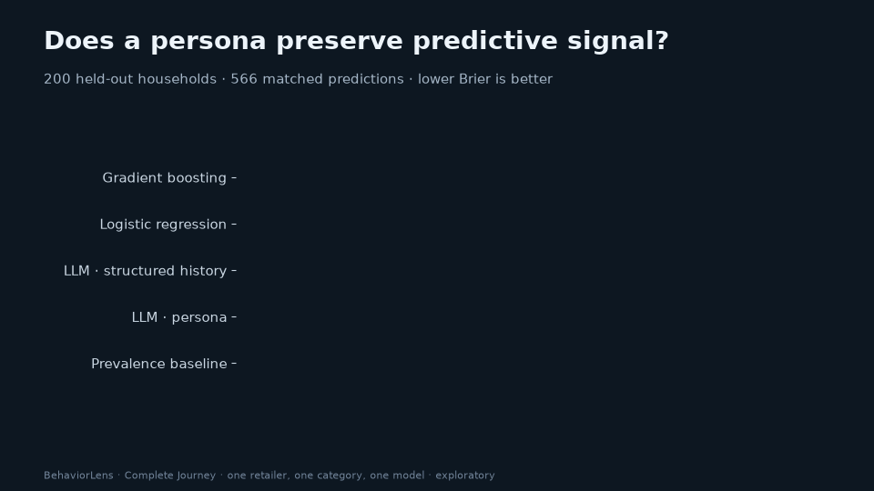

# BehaviorLens

**Do synthetic users predict real behavior, or only sound plausible?** BehaviorLens scores LLM persona predictions against held-out retail transactions. Every number traces back to a saved run.



## Finding: the persona kept the facts but lost the signal

The study used 200 held-out households and 566 matched 28-day predictions of whether a household buys fluid milk (dunnhumby *The Complete Journey*). All five conditions were scored on the same observations.

| Condition | Brier ↓ | Avg precision ↑ |
|---|---:|---:|
| Gradient boosting | 0.1578 | 0.8865 |
| Logistic regression | 0.1581 | 0.8869 |
| LLM · structured history | 0.1756 | 0.8419 |
| LLM · persona (generated from the same history) | 0.1965 | 0.7927 |
| Prevalence baseline | 0.2462 | 0.5618 |

- **Primary result.** Persona minus structured history: **+0.0210 Brier, 95% paired household CI [+0.0097, +0.0326]**. Turning the history into a persona made predictions worse.
- **Secondary result.** Persona minus gradient boosting: +0.0387 [+0.0248, +0.0531]. A simple supervised model beat both LLM conditions.
- **Where the signal went (descriptive, post hoc).** The personas kept 89% of the source numbers verbatim. The extra error was not concentrated in personas that dropped numbers. Resolution fell (0.082 → 0.067): persona forecasts hedged the most on the most frequent buyers (observed rate 0.93, persona mean 0.74). Both LLM conditions also gave near-zero probabilities to recently inactive households, while gradient boosting matched their real 19% purchase rate.

In the engineering pilot (13 points), persona appeared to beat structured history. The larger sample reversed that result, which is why the pilot was not reported as a finding.

**Scope:** one retailer, one category, one model snapshot (GPT-4.1 mini) and one draw per condition. The work is exploratory: it was not externally preregistered, and it makes no claim about general population fidelity or causal mechanism.

## Evidence package

| Artifact | What it is |
|---|---|
| [Evidence report](reports/expansion_v1/report.html) | Full HTML report: comparisons, intervals, calibration, mechanism diagnostics |
| [Research note](reports/expansion_v1/RESEARCH_NOTE.md) | Question, design, results and limits |
| [Evidence card](reports/expansion_v1/EVIDENCE_CARD.md) | One page: what was tested, found and not claimed |
| [Results JSON](reports/expansion_v1/results.json) | Source of every published number |
| [GIF](reports/expansion_v1/evidence.gif) · [MP4](reports/expansion_v1/evidence.mp4) · [chart](reports/expansion_v1/evidence.png) | Media generated from the results JSON |
| [Expansion protocol](docs/EXPANSION_PROTOCOL.md) · [Dataset card](docs/DATASET_CARD.md) | Fixed design, budget guard and data provenance |

Cost: 1,698 API calls with zero failures. Estimated cost was $0.254 including the pilot, under a hard application cap of $0.50.

## How it works

1. **Temporal split.** Features use only the 84 days before each cutoff. Labels cover the following 28 days. Test windows come after training and validation windows.
2. **Matched conditions.** Structured-history and persona prompts derive from identical feature snapshots. The persona is generated first and then used for prediction. Prompts were frozen after the pilot.
3. **Guarded execution.** Spend is reserved before each call and settled against reported usage. There are no retries. An incomplete run cannot be scored on its successful subset.
4. **Verified scoring.** Request, source and baseline hashes are checked before scoring. Uncertainty comes from a paired household bootstrap.
5. **Traceable output.** The local report links each prediction to its source snapshot, generated persona, raw API call and squared-error contribution.

## Reproduce

```sh
uv sync --extra research --frozen
uv run python scripts/download_journey.py
uv run python -m behaviorlens.benchmark --output outputs/complete_journey_v1
# LLM run needs OPENAI_API_KEY in .env (never committed); see docs/OPENAI_PILOT.md
uv run python -m behaviorlens.experiment --plan outputs/expansion_plan_v1 --output outputs/expansion_v1
uv run python -m behaviorlens.research_report --baseline outputs/complete_journey_v1 \
    --run outputs/expansion_v1 --plan outputs/expansion_plan_v1 --publish reports/expansion_v1
uv run python -m behaviorlens.research_exports --results reports/expansion_v1/results.json --output reports/expansion_v1
```

Raw data, household-level snapshots and API responses stay local and are excluded from Git. Published artifacts contain aggregates only.

```sh
PYTHONPATH=src python3 -m unittest discover -s tests -v
```

## Next experiment

- Replicate with frozen new categories and later time windows.
- Repeat model calls to measure stability.
- Compare across model families.
- Score persona fidelity with a rubric defined before viewing outcomes.
- Test whether calibrating persona outputs on validation data recovers the lost resolution.

This is an independent project.
