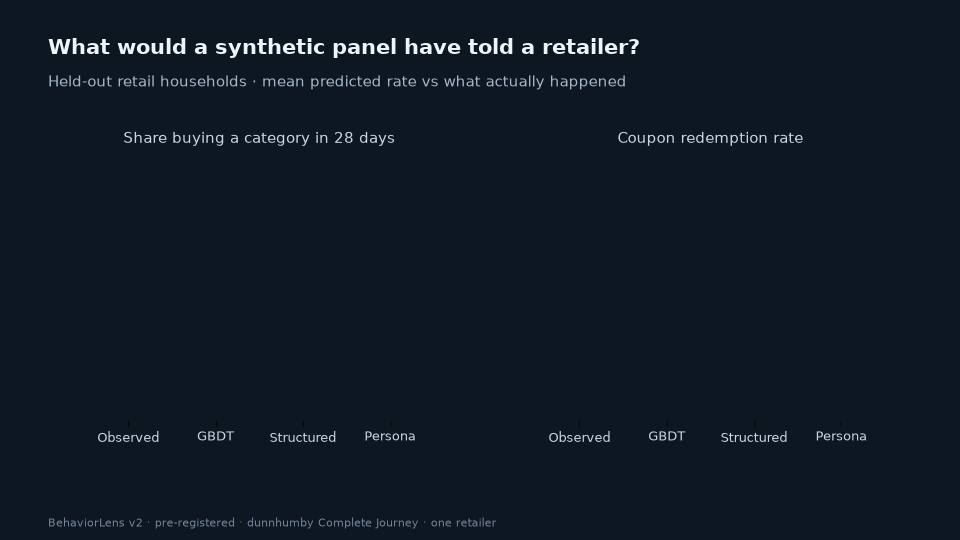

# BehaviorLens

**Do synthetic users predict real behavior, or only sound plausible?** BehaviorLens scores LLM-simulated customers against what real households did next. It uses held-out retail transactions, strong non-LLM baselines, proper scoring rules and household-clustered uncertainty. Every reported number traces back to a saved run.



## Headline result (v2, pre-registered)

**Synthetic customers overstated demand, and none beat a gradient-boosted model.**

Two held-out tests on dunnhumby *The Complete Journey* (one retailer):

- **Study A:** will a household buy each of five categories in the next 28 days? 1,456 household-periods, 7,280 outcomes.
- **Study B:** will a household redeem a coupon from a campaign it received? 2,512 household–campaign pairs across 9 campaigns.

The protocol, prompts and analysis code were committed in [`4ac31dc`](docs/PREREGISTRATION_V2.md) before any model output existed.

| Brier score ↓ (same test rows) | Study A · purchase | Study B · coupons |
|---|---:|---:|
| Base rate | 0.2072 | 0.1190 |
| Logistic regression | 0.1569 | 0.1001 |
| **Gradient boosting** | **0.1571** | **0.0927** |
| LLM · structured shopping record | 0.1747 | 0.1148 |
| LLM · persona written from that record | 0.2297 | 0.1453 |
| LLM · persona, calibrated on validation | 0.1778 | 0.1108 |
| Hybrid: GBDT + structured LLM | 0.1607 | 0.0956 |

The main model is gpt-5.4-mini (2026-03-17). gpt-5.5 was checked on a subsample.

1. **No LLM condition beat gradient boosting.** Structured LLM minus GBDT: +0.0176 [+0.0142, +0.0212] for purchase and +0.0220 [+0.0167, +0.0273] for coupons. Adding the LLM output to GBDT did not help either: +0.0036 and +0.0029, practically small and in the wrong direction.
2. **Personas predicted worse than the record they were written from.** Persona minus structured, 97.5% CI: +0.0550 [+0.0472, +0.0628] for purchase and +0.0306 [+0.0245, +0.0364] for coupons.
3. **Most of that penalty is over-optimism.** A persona-based panel predicted a 52% purchase rate against 33% observed. It predicted 32% coupon redemption against 14% observed. Calibrating on the validation period shrinks the persona gap to +0.0049 [+0.0015, +0.0081] for purchase and +0.0031 [−0.0010, +0.0070] for coupons.
4. **Simulated customers did not rank campaigns reliably.** Rank correlation with observed redemption across nine campaigns: GBDT 0.55, structured LLM 0.13, persona −0.10. This is descriptive; there are only nine points.
5. **A frontier model narrowed the persona gap but not the baseline gap.** On a subsample, gpt-5.5 personas scored 0.1806 against 0.2499 for the main model, but GBDT stayed ahead at 0.1681.

In short, personas kept much of the ranking signal but lost the level. A simulator used to size demand or choose campaigns is read by its levels.

→ [Full evidence report](reports/v2/report.html) · [Results JSON](reports/v2/results.json) · [Pre-registration](docs/PREREGISTRATION_V2.md)

### Scope

- One retailer, using an anonymised public dataset that models may have seen in training.
- One draw per request, so run-to-run stability is not measured.
- One realistic persona design, not an optimised persona pipeline.

The results agree with [When Synthetic Users Fail](https://arxiv.org/abs/2607.26348), which studied surveys, and extend that finding to purchase records and campaign response. Related: [OPeRA](https://arxiv.org/abs/2506.05606).

## How it works

1. **Outcome-blind inputs.** Every prompt, persona and feature uses only records before the prediction day. Labels are stored separately and are never read while requests are built.
2. **Same-source ablation.** The structured and persona conditions start from the identical shopping record and share the task wording. Only the representation differs.
3. **Strong baselines, fit once.** Logistic regression and gradient boosting use fixed hyperparameters and are trained on the train split only. Calibration and hybrid stacking are fit on validation only.
4. **Guarded execution.** Requests go through the OpenAI Batch API under a hard cost cap computed from a token-exact upper bound. Nothing is retried. Failures are counted and never dropped silently.
5. **Honest uncertainty.** Intervals come from a paired household-cluster bootstrap. The co-primary contrasts use Bonferroni-adjusted intervals.

The v2 API cost was $11.89 for 15,957 requests, with zero failed calls.

## Reproduce

```sh
uv sync --extra research --frozen
uv run python scripts/download_journey.py          # dataset terms: academic use; not redistributed here
PYTHONPATH=src uv run python -m behaviorlens.v2 prepare --out outputs/v2
PYTHONPATH=src uv run python -m behaviorlens.v2 estimate --out outputs/v2
# needs OPENAI_API_KEY and BEHAVIORLENS_V2_CAP_USD in .env
PYTHONPATH=src uv run python -m behaviorlens.v2 stage1 --out outputs/v2
PYTHONPATH=src uv run python -m behaviorlens.v2 stage2 --out outputs/v2
PYTHONPATH=src uv run python -c "from behaviorlens.v2_analysis import analyze; analyze('outputs/v2','gpt-5.4-mini-2026-03-17','gpt-5.5-2026-04-23')"
PYTHONPATH=src uv run python -m behaviorlens.v2_report --results outputs/v2/results_v2.json --commit 4ac31dc --out reports/v2
PYTHONPATH=src python3 -m unittest discover -s tests
```

Raw data, household-level inputs, personas and API responses stay local. Published files contain aggregates only.

## Earlier work (v1)

v1 used one category (fluid milk), 200 households, a thin eight-feature persona and gpt-4.1-mini. It found the same direction: persona minus structured +0.021 [+0.010, +0.033]. See the [v1 report](reports/expansion_v1/report.html). Its limits motivated v2.

This independent project is not affiliated with or endorsed by dunnhumby.
